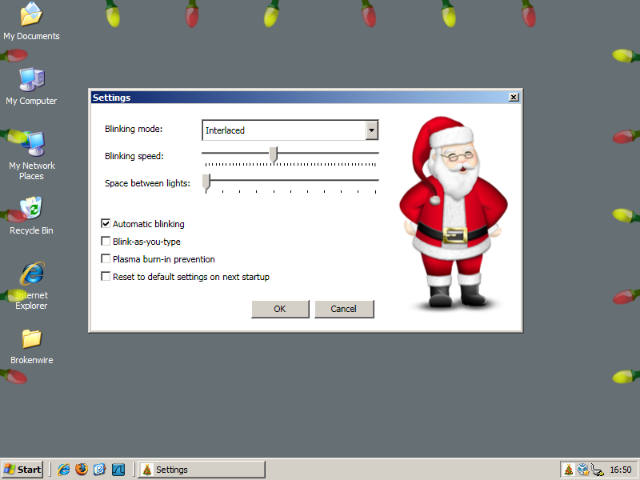

# Project Description #

## What's this all about? ##
WPF Christmas Lights is a small application that decorates your windows desktop with blinking Christmas lights. By running these lights on your desktop you can enjoy the xmas atmosphere without leaving your PC!

## WHY? ##
Because it was possible...

## Installation ##
The easiest way to install the Christmas Lights is via the Click-Once installation page: http://www.brokenwire.net/ChristmasLights/publish.htm

## Does it run on my PC? ##
The lights work on any pc having the .NET Framework version 4 installed. This includes machines running Windows 7, Windows Vista and Windows XP. You don't need the full framework, the lightweight "client-profile" is enough.

## Contributions ##
Feel free to take a look at the source code, if you have any suggestions or improvements just contact me.

## More info ##
http://www.brokenwire.net/bw/Programming/102/be-prepared-get-the-christmas-lights
http://www.brokenwire.net/bw/Various/119/christmas-lights-updated

## Example of the lights in action! ##

If you like the lights and you want to help in the future development you are welcome to fork this repository and submit your pull requests.
